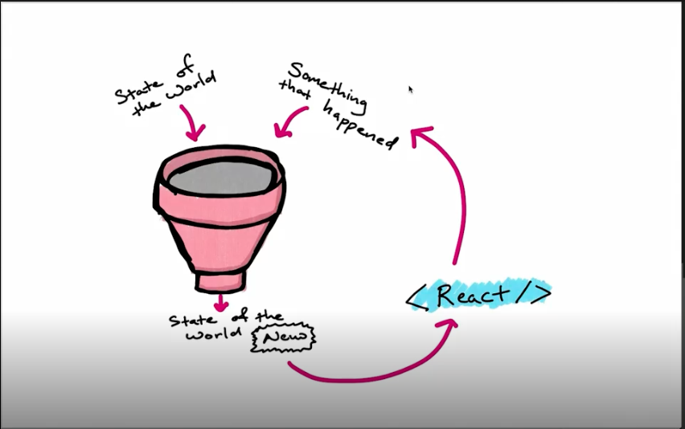

# Plain Old Redux

The course first teaches you about just the Redux library.

## `compose`

`compose` is a function that takes a number of functions and creates a new function by passing the result of one to the next.

For example, these two are equivalent

```js 
const one = string => string + '1';
const two = string => string + '2';

const nestedOneAndTwo = string =>  two(one(string));
const composedOneAndTwo = compose(two, one);

// If it ever matters, compose will run the functions from right to left.
// So in this case, the return value of `one` will be passed to `two` and so on.

const nested = nestedOneAndTwo('hello');
const composed = composedOneAndTwo('hello');

// both will return 'hello12'
```

[Implementation of the course work for `compose`](./01_compose)

## `createStore`

A store is just all the data you're keeping track of. To create a store, you **ONLY** need to pass the function a `reducer`.

It can optionally take an initial state and an enhancer (more on these later).

Since ES6 has default parameters, we can also pass the initial state into to the reducer function.

A store will have a few important methods on it:
- `getState`: returns the current state
- `subscribe`: subscribes  a function to changes on the state. See [`subscribe.js`](./04_subscribe/subscribe.js).
- `replaceReducer`: if you want to swap out the current reducer
- `dispatch`: sends actions to the store. See [`dispatch.js`](./03_dispatch/dispatch.js)

### What is a reducer?

It is a function that takes the current state and some action, then returns a new state.



There are a couple of good to knows/rules for reducers:
- no mutating objects, always return a new object if you are changing something in the state
- must return something, even just the original state
- it's just a JS function

Example reducer
```js
const reducer = (state, action) => {
  if (action.type === "INCREMENT") {
    return { value: state.value + 1 };
  }

  if (action.type === "DECREMENT") {
    return { value: state.value - 1 };
  }

  return state;
};

```

### What is an action?

An action is the event that happened which may cause the state to change.

Actions are only required to have a `type` key.

```js
const incrementAction = { type: "INCREMENT" };
```

However, you can add whatever you want. Usually, you'll see a `payload` key and maybe a `meta` key. The `payload` key will contain any data for action.

What you will often see developers do is create constants for every action type. This helps reduce the likelihood of errors since you'll know if that variable is assigned to something.

Instead of

```js
const incrementAction = { type: "INCREMENT" };
```

You will have

```js
const INCREMENT = "INCREMENT";
const incrementAction = { type: INCREMENT };

```

Another pattern you'll often see is that of **action creators**. Action creators are functions that return an action.

```js
const INCREMENT = "INCREMENT";
const ADD = "ADD";

const increment = () => ({ type: INCREMENT });
const add = amount => ({ type: ADD, payload: amount });
```

### Dispatching an action

Having a store and actions is great, but we need to have a way to connect the two. As mentioned above, `store` has a `dispatch` method.

When you call `dispatch` with an action it will run that action through the `reducer`.

```js
// A do nothing reducer
const reducer = state => state;
const store = createStore(reducer);

const INCREMENT = "INCREMENT"

store.dispatch({ type: INCREMENT })

// If you had an action creator, you could also pass that to the dispatch method
const increment = () => ({ type: INCREMENT })
store.dispatch(increment())
```

If our reducer actually had any logic, it would run it and may update the store's state. 

It may become tedious to write `store.dispatch()` a bunch of times, so there is a helper method to bind the action creator to the dispatch, called `bindActionCreators`

```js
// A do nothing reducer
const reducer = state => state;
const store = createStore(reducer);

const INCREMENT = "INCREMENT";
const ADD = "ADD";

const increment = () => ({ type: INCREMENT });
const add = amount => ({ type: ADD, payload: amount });

const actions = bindActionCreators({ increment, add }, store.dispatch);

// now you can call

actions.increment();
actions.add(100);

// it may be useful to just have these be destructured for easy calling
const { increment: dispatchIncrement, add: dispatchAdd } = actions;

dispatchAdd(20);
```

See [`bindActionCreators.js`](./05_bindActionCreators/bindActionCreators.js.js)

### Dealing with complex reducers

One of the rules of reducers was that you shouldn't mutate an object. This means if we want to change something deeply nested in the state we'll have to maintain the existing values of the object and only update what is needed. To do this we may need to spread the existing state into the new state.

Consider a case where have users and tasks in our state. Every time we updated one, we'd have to maintain the current state of the other. Although this isn't that bad, it can only get more complex with deeper nesting.

```js
const reducer = (state = initialState, action) => {
  if (action.type === ADD_USER) {
    return {
      ...state,
      users: [...state.users, action.payload]
    };
  }
  if (action.type === ADD_TASK) {
    return {
      ...state,
      tasks: [...state.tasks, action.payload]
    };
  }
};
```

There are two approaches we could use. 
1. Flatten the store data as much as possible. This may require your store to have a different structure than the data received from an API for example. You'd just have to write the code to transform it both ways, i.e., from the API and to the API.
2. Split up reducers to focus on a specific part of the state.

### `combineReducers`

`combineReducers` combines a number of reducers by assigning them to run on certain parts of your store's state.

If we were to split up the reducer from the example above into two reducers, one for tasks and one for users, it may look like this.

```js
const userReducer = (users = initialState.users, action) => {
  if (action.type === ADD_USER) {
    return [...users, { name: action.payload }];
  }

  return users;
};

const taskReducer = (tasks = initialState.tasks, action) => {
  if (action.type === ADD_TASK) {
    return [...tasks, { title: action.payload }];
  }

  return tasks;
};
```

To combine the two reducers, we need to assign each to a part of the state using `combineReducers`.

```js
const reducer = combineReducers({ users: userReducer, tasks: taskReducer });

const store = createStore(reducer);
```

Every action will still flow through **ALL** reducers, similar to having one large reducer, but by keeping them separate it makes the logic easier to reason about.

## Extending Redux

We have two options available to us to extend the functionality of Redux.

### Enhancers
The first is an enhancer. It is used to add additional functionality to `createStore`. An example would be the Redux Developer Tools, which adds a lot of functionality to Redux.

An enhancer is passed to the `createStore` function, as the 2nd or 3rd argument.

Let's say we want to add an enhancer that monitors time to run the reducer. The enhancer is a curried function that returns a store.

```js
const logEnhancer = createStore => (reducer, enhancer) => {
  const logReducer = (state, action) => {
    console.log("Action: ", action.type);
    console.log("Previous state: ", state);
    const newState = reducer(state, action);
    console.log("New state: ", newState);

    return newState;
  };
  return createStore(logReducer, enhancer);
};

const store = createStore(reducer, logEnhancer);

```
### Middleware

Middleware are commonly used to do something when an action is dispatched, either before or after. The most common use case is async requests. Since reducers are pure functions, i.e., same inputs gives you the same outputs, they're not supposed to handle side effects, i.e., async, etc.

Middleware functions all follow the same signature. A good way to remember is the first three letters of **S N A C K**:
- **S**tore
- **N**ext
- **A**ction

```js
const middlewareFunction = store => next => action => {
  // anything done before calling `next` will happen **before** the reducer has run
  next(action);
  // anything done after calling `next` will happen **after** the reducer has run
}
```

Calling `next` passes the action to the next middleware or dispatches the action if no other middleware exists.

If we rewrote the logging enhancer from before as middleware, it would look like this.

```js
const logMiddleware = store => next => action => {
  // Pre reducer
  console.log("Action: ", action.type);
  console.log("Previous state: ", store.getState());

  // Moving to the next middleware, or dispatching the action if it is the last middleware
  next(action);

  // Post reducer
  console.log("New state: ", store.getState());
}
```

Since the `createStore` function only accepts an enhancer, you need to use `applyMiddleware` to create an enhancer function from the middleware.

```js
const store = createStore(reducer, applyMiddleware(logMiddleware));
```

Similar to enhancers, we can also combine middleware using `applyMiddleware` to run them in series.

```js
const logMiddleware = store => next => action => {
  console.log("Action: ", action.type);
  console.log("Previous state: ", store.getState());
  next(action);
  console.log("New state: ", store.getState());
};

const performanceMiddleware = store => next => action => {
  const start = performance.now();
  next(action);
  console.log("Execution time: ", performance.now() - start);
};

const store = createStore(
  reducer,
  applyMiddleware(logMiddleware, performanceMiddleware)
);
```

This will first run `logMiddleware` then `performanceMiddleware`.